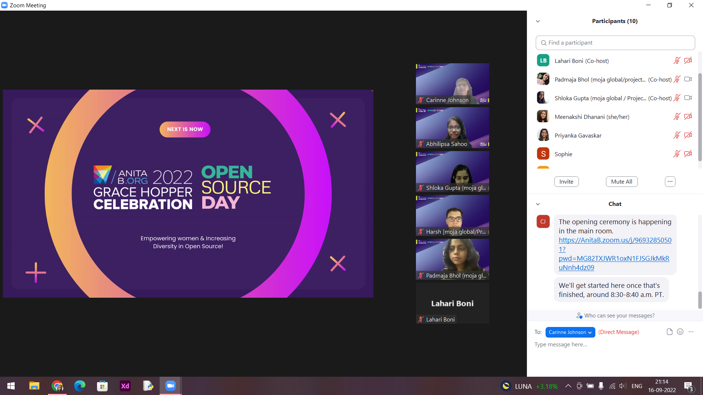

---
authors:
  name: Abhilipsa Sahoo
  title: GHC Open Source Day 2022 Mentor for FLINT
  url: https://github.com/abhilipsasahoo03
  image_url: https://avatars.githubusercontent.com/abhilipsasahoo03
tags: [osd, opensource, ghc]
---

# Grace Hopper Celebration Open Source Day 2022 Recap
## Moja Global's involvement in OSD 2022 👭👭

> _"Each one of us can make a difference. Together we make change._"
>
> — Barabara Mikulski

Imagine an entire day dedicated towards getting to be a part of a global community, using your skills to contribute to projects designed to solve real world problems, interacting with and learning from remarkable women around the globe, and making a difference in the world!

Cue the drum roll 🥁: **_That's Open Source Day for ya!_**

[Open Source Day (OSD) 2022](https://anitab-org.github.io/open-source-day/) was an all-day hackathon that took place as a pre-event to the Grace Hopper Celebration (GHC) 2022. The event took place virtually on September 16, 2022 from 8am to 3pm US Pacific Time. We, the Moja Global Team, had the immense pleasure of taking part as a Project Partner in the event with our Full Lands INtegration Tool (FLINT) Project: [FLINT UI](https://github.com/moja-global/FLINT-UI) and [FLINT Cloud](https://github.com/moja-global/FLINT.Cloud) in order to help participants:

- understand the importance of open source technology in revolutionizing the fight against climate change.
- kick-start their own open-source journeys as contributors and mentors.

It's always a delight to participate in these events and create an amazing day for contributors to experience Open Source in a safe, supportive and fun environment!

## Preparation 🛠️
In August 2022, Mentor-Project assignments were finalized based on the reviews by the Grace Hopper Celebration Open Source Day Committee, and three mentors were assigned to FLINT: [Meenakshi Dhanani](https://github.com/meenakshi-dhanani), [Lahari Boni](https://github.com/LahariBoni), and [Abhilipsa Sahoo](https://github.com/abhilipsasahoo03), who, under the guidance of the project representatives: [Harsh Mishra](https://github.com/HarshCasper), [Padmaja Bhol](https://github.com/padmajabhol), and [Shloka Gupta](https://github.com/chicken-biryani), familiarized themselves with the repositories to prepare for the event.

Prior to the day of the event, representatives, mentors and OSD Committee Member/Moderator actively discussed their roles and responsibilities through the main communication channel and welcomed new contributors. The mentors and representatives also created new issues and triaged existing ones that would be suitable for the new contributors to the project. Care was taken that the descriptions of these issues had lots of details and helpful pointers for getting started. These issues were the labelled as **beginner friendly** and **OSD** to make them distinguishable from other issues for the beginners. Detailed guidelines were already put up in order for participants to refer to and set up their projects in their local machines.

## The Final Day 🎉🎊

The day began with a powerful opening ceremony that featured speakers Anne Neuberger (Deputy Assistant to the President & Deputy National Security Advisor for Cyber & Emerging Technologies at the White House), Nithya Ruff (Head of the Open Source Program Office at Amazon), and Mishi Choudhary (SVP and General Counsel at Virtru). It was amazing to hear from these exceptional women and watch them inspire a new generation to join open source software projects!

After the opening ceremony, it was time for mentors and team members to introduce themselves and give an overview of the Moja Global and FLINT. Then they covered some general information on how to make contributions to the project, and curated a list of important websites such as Moja Global's community website, Moja Global Handbook, FLINT website, in order for participants to understand how and why to use an open-source software tech such as FLINT to assess land-use emissions, FLINT's role in climate action, its functionalities as well as commercial applications, and how one can contribute to the mission of Moja Global. After that, it was time to officially start the hackathon!

During the hackathon, the Moja Global team members and mentors provided one-on-one uninterrupted guidance to the participants in setting up their development environment (in the local machine as well as on GitPod), answered questions about Git and the process of submitting and updating pull requests, helped participants pick and work on their issues, and provided feedback on their pull requests. We ended the day with merging successful pull requests from several first-timers!
